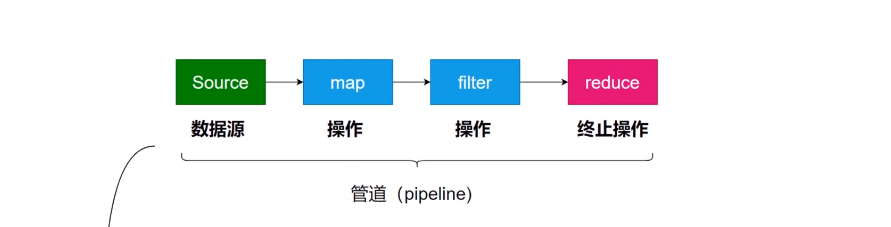
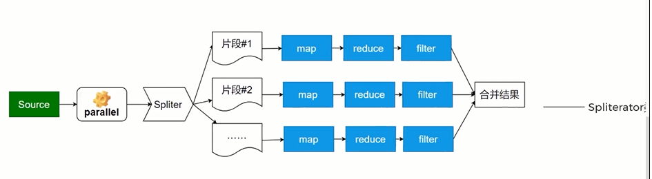
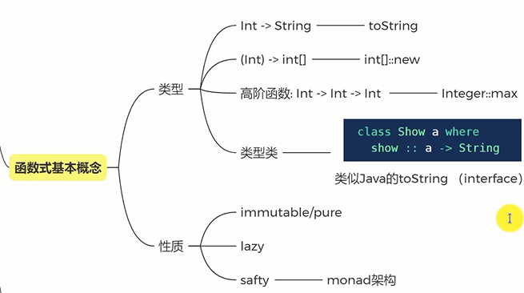

《笑傲java面试：面霸修炼手册》

java8steam

1.为一组序列提供顺序、并行运算

> 流：随时间产生的数据序列

​	1）支持函数式编程

​	2）提供管道运算能力（**一个计算过程的输出作为另一个计算过程的输入**）

​	3）提供并行parallel计算能力

​	4）提供大量的操作

2.提供流计算




​	1）操作：
​		（1）状态：

​			a.有状态：sorted skip limit 任何处罚状态变化的程序

​			b.无状态：map reduce

​		（2）副作用：

​			a.纯函数:没有副作用的函数

​			b.非纯函数

> lambda表达式：相当于一种匿名的函数

3.提供并发计算



4.函数式基本概念



5.monad

> 一个自函子范畴的一个幺半群

（1）monada设计模式特点

- 一个泛型的构造函数，如Optional<T>
- 不改变泛型类型的运算操作，内部是非泛型计算

> **例：可以改变其中的数据类型，但不能改变本身的Stream类型**
>
> ```java
> // Stream<String>
> var result = Stream.of("Hello", "World")
>         .map(String::length);
> ```

> 一个比较不错的例子
>
> https://www.jdon.com/idea/java8-monad.html

- 泛型类型不变。

> 比如可以使Optional<Integer>到Optional<String> 但还是Optional<T>

（2）使用monada基本流程

- 明确一个概念：即monad是将输入A输出B抓变为 通过泛型输入 A，通过泛型转变为B

> **（A->B）--> (M<A>->M<B>)**

- 定义函数式泛型接口：

如：

```java
@FunctionalInterface
interface FN<A,B>{
	B apply(A a);
}
```

- 自函子实现：
- 示例

```java
// 自定义流式计算 将event转为eventData
public class Event<T>{
    T data;
    public Event(T data){ this.data = data; }
    static class EventData {
        Integer id;
        String msg;
        public EventData(Integer id, String msg) {
            this.id = id;
            this.msg = msg;
        }
    }
	// 用于流式计算中间步骤：对数据的映射处理（map）
    static class Transforms {
        static EventData transform(Integer id) {
            switch(id) {
                case 0: return new EventData(id, "Start");
                case 1: return new EventData(id, "Running");
                case 2: return new EventData(id, "Done");
                case 3: return new EventData(id, "Fail");
                default: return new EventData(id, "Error");
            }
        }
    }
	// 定义函数式泛型接口--lambda表达式使用
    @FunctionalInterface
    interface FN<A, B> {
        B apply(A a);
    }
	// 自定义map操作，传入的函数接口参数为自定义函数式接口
    <B> Event<?> map(FN<T, B> f) {
        return new Event<>(f.apply(this.data));
    }

    public static void main(String[] args) {
        Stream<Event<Integer>> s = Stream.of(
                new Event<>(1),
            	······
        );
        // map操作使用定义的transform-- 严格按照参数FN（自定义的函数式接口）定义
        s.map(event -> event.map(Transforms::transform))
                .forEach(e ->
                    System.out.println(e.data)
                );
    }
}
```

> Transforms::transform：可插拔的程序、复用性强
>
> 假如以后需要将event转为其他对象，定义新的方法替换即可

（3）幺半群

- 群：一类事物，一类符合某种条件的对象（如Optional、Stream、Event），泛型使得只要符合Optional（或其他的）规范，就是同一个群
- 自函子上的群：群中的对象和自函子一起使用达到某种效果
  - 封闭性：相同的群通过某种方式结合到一起群不变
  - 结合律：多个自函子操作后的结果与自函子顺序无关
  - 单位元：

