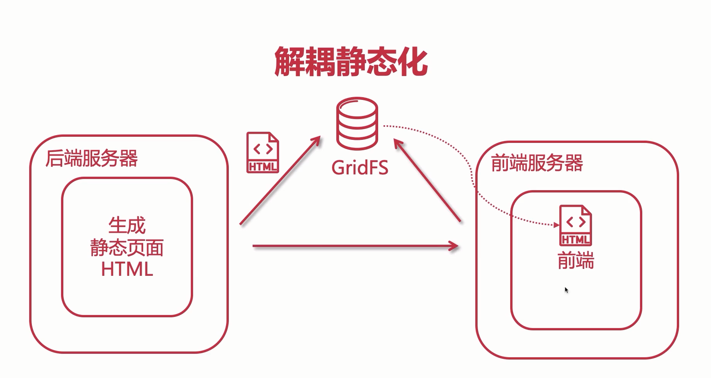

## 2020年7月8日

结束c#基础学习（高级编程除外），开始u3d基础学习,b站香槟堡伯爵讲课过于拖沓，考虑更换视频
文字教程
http://c.biancheng.net/unity3d/
视频教程
慕课 https://www.imooc.com/learn/313

## 2020年7月9日

游戏开发学习进度：观看慕课u3d基础视频

## 2020年7月10日

微服务学习：阿里云大学视频 https://edu.aliyun.com/roadmap/microservice?spm=5176.13345299.1392477.2.4a83f153Rw9qM
## 2020年7月11日

微服务学习：继续视频，根据官方文档建立demo

## 2020年7月13日

微服务学习：初步认识了nacos服务发现，学习nacos分布式配置中心

## 2020年7月28日

日子一下子就过去了，此后一直没有继续学习
早上再早起二十分钟，七点二十出门，
早上花费的时间大致在35分钟左右，通勤40分钟，八点到公司的话，至少要在六点四十起床，那么起码八点-九点半之间可以自由学习

## 2020年7月29日

## **2020年8月03日**

改变计划，8月份先啃spring源码

## **2020年8月04日**

改变计划，8月份先啃spring源码或并发、优化、性能等相关问题

今日感兴趣的事情：搭建es集群+压测

https://mp.weixin.qq.com/s?__biz=MzI4Njk5OTg1MA==&mid=2247484933&idx=1&sn=fcb8f09f7a4af2ed7fe52a1b9b7e39ac&chksm=ebd51240dca29b56221fc615be8a80770258356ef0eabd0f92628b2bce659e91da486b87bd69&scene=126&sessionid=1596508924&key=4435c9834d0607a7acc2d66515a921cda9381565a0204513358159a0a68f206bf00840f3dfb2555ffea8c914885e4799268ea60ad465a489ece628569d393ba0e7c40c3715992a38bd590c21f58e0f2f&ascene=1&uin=MjMwMTEyMDg3NA%3D%3D&devicetype=Windows+10+x64&version=62090529&lang=zh_CN&exportkey=AW%2BwkuaE1FrQrTOZj%2Bd%2BA60%3D&pass_ticket=MlvmEJXP%2BET3u9eO3k8NG14fKtoq%2FteoGCiRHcezs5ihwT7enoU4rUFshktnDB%2FB

https://mp.weixin.qq.com/s?__biz=MzI3ODcxMzQzMw==&mid=2247491631&idx=2&sn=42537edb7cc04a7e4e60c5727ec348ac&chksm=eb506519dc27ec0ffd7a4e107063b6b2b1013aefd8ed7e97e359ae9a6144181fce8ff76c66ac&scene=21#wechat_redirect

## **2020年8月06日**

今日、疲惫。。。。。划水

## **2020年8月07日**

乱掉了。。。。。随缘学习吧

## **2020年8月13日**

近日：activiti

## **2020年8月14日**

## **看到的文章**

如何用 SpringBoot 实现并发登录人数控制（附代码）

[https://mp.weixin.qq.com/s?__biz=MzU2MTI4MjI0MQ==&mid=2247493102&idx=1&sn=28441e8e73619492d2273215f16f4afe&chksm=fc798840cb0e0156814ea37f9f6f82cdc0c0664e66d6f6d806fd37257a96d896ce1e6ca27f9d&scene=126&sessionid=1597309217&key=d346675dd6ecd6cce249b405bb9a90aa79b7c54f7c569368c928f8a0fba084157e2d5f8bcf520c432a62b78b75bcf34f637ffffec8103fe30ba90c88876a70ded60bb9c899a3c67f5ca58b254e3f8075&ascene=1&uin=MjMwMTEyMDg3NA%3](https://mp.weixin.qq.com/s?__biz=MzU2MTI4MjI0MQ==&mid=2247493102&idx=1&sn=28441e8e73619492d2273215f16f4afe&chksm=fc798840cb0e0156814ea37f9f6f82cdc0c0664e66d6f6d806fd37257a96d896ce1e6ca27f9d&scene=126&sessionid=1597309217&key=d346675dd6ecd6cce249b405bb9a90aa79b7c54f7c569368c928f8a0fba084157e2d5f8bcf520c432a62b78b75bcf34f637ffffec8103fe30ba90c88876a70ded60bb9c899a3c67f5ca58b254e3f8075&ascene=1&uin=MjMwMTEyMDg3NA%3D%3D&devicetype=Windows+10+x64&version=62090529&lang=zh_CN&exportkey=ARCIMmczi34%2FUt%2BLRaSVoLc%3D&pass_ticket=t%2BgkW4A7OsLCDXILVKSMzwz8xeSaWFX3xaI%2FbssAZqhRTK%2BwqmE9Ja3V%2F1FpPdSK)


## **2020年8月20日**

谷粒商城2020列入计划，先处理原先的一些半途没做的东西吧。
## **2020年9月10日**
redissionClient。

## **2020年10月17日**

近期学习：

百度ai中图像识别与人脸识别的初探
进度：基础api了解完毕，正在申请离线采集SDK和离线识别SDK

### **（要注意的是，激活后只有三个月的有效期，不能浪费掉）**

模拟并发场景的分布式锁控制，进行了简单的jmeter测试

sentinel学习

## **2020年10月19日**

zookeeper应用场景、选举机制、数据模型

> https://www.bilibili.com/video/BV1JT4y1g7nM?p=28

开始大数据基础学习


## **2020年10月21日**

学习axios，但在尝试与vue整合是，发现建立新的完整的vue项目并不熟练，需要从建vue项目开始，包括路由配置等等

## **2020年10月22日**

- 近期观看黑马官方的大数据hadoop入门教程，感觉很多都只是照课件按部就班念，讲到一些指令，一些需要安装的软件，甚至没有提一下作用，并且教程使用的软件都比较旧，故停止观看。另觅。
- 需要整理一下网盘，快满了，去除意义不大的视频

## **2020年10月23日**

- Python入门学习，基本语法

## **2020年10月26日**

- hadoop环境搭建，不顺利，可能还没从周末缓过来，头脑不清楚

## **2020年10月27日**

- gogs环境搭建--ssh方式连接失败，寻找原因


## **2020年10月28日**

- gogs搁置（ssh方式多分支），回自己的电脑上试
- hadoop环境搭建
- hadoop集群搭建
- 搭了一天的环境

## **2020年10月29日**

- hadoop集群搭建成功
- 学习hdfs

## **2020年10月30日**

- 学习hdfs

## **2020年10月31日**

- 学习hdfs 文件操作
- 周末：整理一下网盘、游戏开发、月末总结

## **2020年11月03日**

- 学习MapReduce


## **2020年11月05日**

- springboot构建电商秒杀基础项目 项目搭建  配置mybatis自动生成工具遇到一些问题
- 明日：下载慕课网友提供的代码调通，检查合理性，把重点放在秒杀设计和优化上。

## **2020年11月06日**

- springboot构建电商秒杀基础项目搭建完成，github push速度过慢，需要寻找有效的解决方法

## 2020年11月11日

- springboot秒杀项目
  - 页面调整
  - 图片显示
  - 静态资源处理

## 2020年11月12日

- springboot秒杀项目
  - 并发容量问题
    - tomcat连接数、最大等待队列数量、最大线程数配置

## 2020年11月13日

- 解决虚拟机网络突然不通的问题

  - 可能原因：

  之前装过virtualbox，后来卸掉了，可能网络有冲突

  将VMnet1禁掉后，成功ping通

  解决虚拟机网络突然不通的问题

- springboot秒杀项目

  - 分布式扩展

    - 单机容量问题--水平拓展

      将应用部署在多台服务器上

    - nginx安装（openResty）

      1. 前置条件

         `yum install pcre-devel openssl-devel gcc curl`

      2. 解压

      3. 初始化配置

         `./configure`

         `gmake`

         `gmake install`

         结果路径：

         /usr/local/openresty

      4. 启动

         `sbin/nginx -c conf/nginx.conf `

## 2020年11月15日

- 解决centos下，设置静态ip后，与宿主机ping通但与外部网络无法ping通（以百度为例）

  - 虚拟机网络设置中，对于VMnet8，不要勾选“使用本地DHCP服务将ip分配给虚拟机”
  - 确定宿主机的dns服务器设置
  - 在虚拟机中，将网关设置为 vm虚拟网络配置中“net设置“中设置的网关
  - 在虚拟机中，设置dns1，值为宿主机中设置dns服务器地址
  - 若出现虚拟机可ping通宿主机和外部网络，但宿主机无法ping通虚拟机网络，则需要检查网络适配器中`VMware Virtual Ethernet Adapter for VMnet8`的配置，手动配置网关等

- mysql授权远程连接

`grant all privileges on *.* to root@'%' identified by 'dandelion';`

将所有的权限授权给从任何ip登录的root用户，并需要验证密码

“%”可替换为允许连接的某个ip

验证：

`select host,user,password from user;`

- springboot秒杀项目
  
- deploy方式启动
  
  - 创建deploy.sh
  
  
  
    ```shell
    nohup java -Xms400m -Xmx400m -XX:NewSize=200m -XX:MaxNewSize=200m  -jar demo-0.0.1-SNAPSHOT.jar  --spring.config.addition-location=/my/projects/application.properties
    ```
  
    
  
    - 运行
  
    
  
    ```
    ./deploy.sh
    ```
  
    
  
    - 查看运行日志
  
  ```
  tail -200f nohup.out
  ```
  

  
  - 分布式扩展
  
    - nginx反向代理配置，实现动静分离
  
      配置样例：
  
          upstream backend_server{
                  server pc-3 weight=1;
                  server pc-4 weight=1;
              }
          server {
              listen       80;
              server_name  localhost;
              #charset koi8-r;
          
              #access_log  logs/host.access.log  main;
          
              location /resources/ {
                  alias  /usr/local/openresty/nginx/html/;
                  index  index.html index.htm;
              }
              location / {
                  proxy_pass http://backend_server;
                  proxy_set_header Host $http_host:$proxy_port;
                  proxy_set_header X-Real-Ip $remote_addr;
                  proxy_set_header X-Forwarded-For $proxy_add_x_forwarded_for;
              }
              ······
          }
  
- - **实测结果（线程数：1000，循环次数10）**：

单机(url:http://192.168.80.133/user/getUser?id=5)：

| Label    | # 样本 | 平均值 | 中位数 | 90% 百分位 | 95% 百分位 | 99% 百分位 | 最小值 | 最大值 | 异常 % | 吞吐量    | 接收 KB/sec | 发送 KB/sec |
| -------- | ------ | ------ | ------ | ---------- | ---------- | ---------- | ------ | ------ | ------ | --------- | ----------- | ----------- |
| HTTP请求 | 10000  | 745    | 712    | 916        | 1424       | 10257      | 1      | 11071  | 0.00%  | 789.82703 | 245.28      | 0           |

负载均衡(url:http://192.168.80.131/user/getUser?id=5)：

| Label    | # 样本 | 平均值 | 中位数 | 90% 百分位 | 95% 百分位 | 99% 百分位 | 最小值 | 最大值 | 异常 % | 吞吐量    | 接收 KB/sec | 发送 KB/sec |
| -------- | ------ | ------ | ------ | ---------- | ---------- | ---------- | ------ | ------ | ------ | --------- | ----------- | ----------- |
| HTTP请求 | 10000  | 363    | 105    | 862        | 1188       | 6217       | 1      | 6606   | 25.66% | 1116.5699 | 1007.98     | 0           |


- **nginx设置与后端服务器之间建立的连接为长连接(按教程上讲是为了减少短连接创建关闭的资源消耗,未测试)**

  - 默认的http协议为1.0，将http协议改为1.1，并且将连接策略“proxy_set_header Connection”置空

  - 配置样例：

        upstream backend_server{
                server pc-3 weight=1;
                server pc-4 weight=1;
                keepalive 30
            }
        server {
            listen       80;
            server_name  localhost;
            #charset koi8-r;
        
            #access_log  logs/host.access.log  main;
        
            location /resources/ {
                alias  /usr/local/openresty/nginx/html/;
                index  index.html index.htm;
            }
            location / {
                proxy_pass http://backend_server;
                proxy_set_header Host $http_host:$proxy_port;
                proxy_set_header X-Real-Ip $remote_addr;
                proxy_set_header X-Forwarded-For $proxy_add_x_forwarded_for;
                proxy_http_version 1.1;
                proxy_set_header Connection "";
            }
            ······
        }

    

## 2020年11月16日

- jfinal全局异常拦截处理

## 2020年11月17日

- 分布式扩展

  - 分布式会话

    - springboot+springsession+redis

      **遇到的问题**

      写入session，随即输出，有值

      再次请求获取，null，疑是跨域问题

      同域测试正常

      `@RequestMapping("redisTest") @ResponseBody public Object redisTest(HttpServletRequest request){    request.getSession().setAttribute("request Url",request.getRequestURL());    return request.getRequestURL(); } @RequestMapping("getRedis") @ResponseBody public Object getRedis(HttpServletRequest request){    return request.getSession().getAttribute("request Url"); }`

      

      `org.springframework.beans.factory.BeanCreationException: Error creating bean with name 'enableRedisKeyspaceNotificationsInitializer' defined in class path resource [org/springframework/session/data/redis/config/annotation/web/http/RedisHttpSessionConfiguration.class]: Invocation of init method failed; nested exception is org.springframework.data.redis.RedisConnectionFailureException: Unable to connect to Redis; nested exception is io.lettuce.core.RedisConnectionException: Unable to connect to 192.168.80.132:6379`

    DENIED Redis is running in protected mode because protected mode is enabled, no bind address was specified, no authentication password is requested to clients. In this mode connections are only accepted from the loopback interface. If you want to connect from external computers to Redis you may adopt one of the following solutions: 1) Just disable protected mode sending the command 'CONFIG SET protected-mode no' from the loopback interface by connecting to Redis from the same host the server is running, however MAKE SURE Redis is not publicly accessible from internet if you do so. Use CONFIG REWRITE to make this change permanent. 2) Alternatively you can just disable the protected mode by editing the Redis configuration file, and setting the protected mode option to 'no', and then restarting the server. 3) If you started the server manually just for testing, restart it with the '--protected-mode no' option. 4) Setup a bind address or an authentication password. NOTE: You only need to do one of the above things in order for the server to start accepting connections from the outside.

    翻译：

    拒绝的Redis正在保护模式下运行，因为已启用保护模式，未指定绑定地址，未向客户端请求身份验证密码。在此模式下，只接受来自环回接口的连接。如果您想从外部计算机连接到Redis，您可以采用以下解决方案之一：1）只需禁用保护模式，通过从服务器运行的同一主机连接到Redis，从环回接口发送命令“CONFIG SET protected mode no”；但是，如果您这样做吧。使用CONFIG REWRITE使此更改永久化。2） 或者，您可以通过编辑Redis配置文件并将protected mode选项设置为“no”，然后重新启动服务器来禁用保护模式。3） 如果您只是为了测试而手动启动服务器，请使用“-protected mode no”选项重新启动服务器。4） 设置绑定地址或身份验证密码。注意：您只需执行上述操作之一，服务器就可以开始接受来自外部的连接。

    

    **尝试修改：将redis.conf文件中protected-mode设置为no，禁用保护模式即可**

    - 

    

## 2020年11月18日

- springboot秒杀项目

  - 分布式扩展

    - 分布式会话

      - 基于token

        localStorage+redis+token

  - 查询缓存优化

    - redis查询缓存基础用法
      - redisTemplate
      - 自定义RedisTemplate

```java
package cn.running4light.demo.config;

import cn.running4light.demo.serializer.JodaDateTimeJsonDeSerializer;
import cn.running4light.demo.serializer.JodaDateTimeJsonSerializer;
import com.fasterxml.jackson.databind.ObjectMapper;
import com.fasterxml.jackson.databind.jsontype.impl.LaissezFaireSubTypeValidator;
import com.fasterxml.jackson.databind.module.SimpleModule;
import org.joda.time.DateTime;
import org.springframework.context.annotation.Bean;
import org.springframework.data.redis.connection.RedisConnectionFactory;
import org.springframework.data.redis.core.RedisTemplate;
import org.springframework.data.redis.serializer.Jackson2JsonRedisSerializer;
import org.springframework.data.redis.serializer.StringRedisSerializer;
import org.springframework.session.data.redis.config.annotation.web.http.EnableRedisHttpSession;
import org.springframework.stereotype.Component;

/**
 *
 */
@Component
@EnableRedisHttpSession(maxInactiveIntervalInSeconds = 3600)
public class RedisConfig {
    // 定制化redisTemplate
    @Bean
    public RedisTemplate redisTemplate(RedisConnectionFactory redisConnectionFactory){
        RedisTemplate redisTemplate = new RedisTemplate();
        redisTemplate.setConnectionFactory(redisConnectionFactory);
        // 设置key序列化方式--string形式
        StringRedisSerializer stringRedisSerializer = new StringRedisSerializer();
        redisTemplate.setKeySerializer(stringRedisSerializer);
        // 设置value序列化方式
        Jackson2JsonRedisSerializer jackson2JsonRedisSerializer = new Jackson2JsonRedisSerializer(Object.class);

        // redis：扩充特殊对象的字符转换
        ObjectMapper objectMapper = new ObjectMapper();
        SimpleModule simpleModule = new SimpleModule();
        simpleModule.addSerializer(DateTime.class,new JodaDateTimeJsonSerializer());
        simpleModule.addDeserializer(DateTime.class,new JodaDateTimeJsonDeSerializer());

//        objectMapper.enableDefaultTyping(ObjectMapper.DefaultTyping.NON_FINAL);
        objectMapper.activateDefaultTyping(LaissezFaireSubTypeValidator.instance ,ObjectMapper.DefaultTyping.NON_FINAL);// 不完全懂基础作用
        objectMapper.registerModule(simpleModule);
        jackson2JsonRedisSerializer.setObjectMapper(objectMapper);

        redisTemplate.setValueSerializer(jackson2JsonRedisSerializer);

        return redisTemplate;
    }
}
```


- 本地热点缓存

  - guava cache

  

  - 依赖

  ```
          <dependency>
              <groupId>com.google.guava</groupId>
              <artifactId>guava</artifactId>
              <version>23.0</version>
          </dependency>
  ```

  

  - 封装

  ```java
  import cn.running4light.demo.service.CacheService;
  import com.google.common.cache.Cache;
  import com.google.common.cache.CacheBuilder;
  import org.springframework.stereotype.Service;
  
  import javax.annotation.PostConstruct;
  import java.util.concurrent.TimeUnit;
  
  @Service
  public class CacheServiceImpl implements CacheService {
  
      private Cache<String, Object> commonCache;
  
      // bean加载时优先执行
      @PostConstruct
      public void init() {
          commonCache = CacheBuilder.newBuilder()
                  // 初始化容量
                  .initialCapacity(10)
                  // 设置缓存中最大可以存储的key值数量，超过后会按照LRU的策略移除缓存项
                  .maximumSize(100)
                  // 写入缓存后的过期时间（本地热点缓存生命周期需要比redis短很多）
                  .expireAfterWrite(30, TimeUnit.SECONDS).build();
      }
  
      @Override
      public void setCommonCache(String key, Object value) {
          this.commonCache.put(key, value);
      }
  
      @Override
      public Object getFormCommonCache(String key) {
          return this.commonCache.getIfPresent(key);
      }
  }
  ```

  

  - 使用

  ```java
      public CommonResult getItem(@RequestParam(name = "id") Integer id) {
          // 取本地热点缓存
          ItemModel itemModel = (ItemModel) cacheService.getFormCommonCache("item_" + id);
          System.err.println("本地热点缓存：\t"+itemModel);
          if (itemModel == null) {
              // 取redis缓存
              itemModel = (ItemModel) redisTemplate.opsForValue().get("item_" + id);
              System.err.println("redis缓存：\t"+itemModel);
              if (itemModel == null) {
                  // 取数据库数据
                  itemModel = itemService.getItemById(id);
                  System.err.println("数据库：\t"+itemModel);
                  redisTemplate.opsForValue().set("item_" + id, itemModel);
                  redisTemplate.expire("item_" + id, 50, TimeUnit.SECONDS);// 5秒过期时间
              }
              cacheService.setCommonCache("item_" + id, itemModel);// 更新本地热点缓存
          }
          ItemVO itemVO = convertFromItemModel(itemModel);
          return CommonResult.create(itemVO);
      }
  ```

  

  - 压测：（**未测**）

  

  

  - 缺点：
    - jvm内存资源
    - 数据变动的更新策略

## 2020年11月19日

- springboot秒杀项目

  - 

  - nginx proxy cache

    - 配置

      nginx.conf

      ```properties
      #申明一个cache缓存节点的内容(配置nginx proxy cache)
      proxy_cache_path /usr/local/openresty/nginx/tmp_cache levels=1:2 keys_zone=tmp_cache:100m inactive=7d max_size=10g;
       #(配置nginx proxy cache)start
       proxy_cache tmp_cache;
       proxy_cache_key $uri;
       proxy_cache_valid 200 206 304 302 7d;
       #(配置nginx proxy cache)end
      ```

      

    - 压测(url:192.168.80.131:/item/get?id=6)

    | Label    | # 样本 | 平均值 | 中位数 | 90% 百分位 | 95% 百分位 | 99% 百分位 | 最小值 | 最大值 | 异常 % | 吞吐量     | 接收 KB/sec | 发送 KB/sec |
    | -------- | ------ | ------ | ------ | ---------- | ---------- | ---------- | ------ | ------ | ------ | ---------- | ----------- | ----------- |
    | HTTP请求 | 100000 | 0      | 0      | 1          | 2          | 7          | 0      | 132    | 0.00%  | 3349.85931 | 1867.79     | 0           |
    | 总体     | 100000 | 0      | 0      | 1          | 2          | 7          | 0      | 132    | 0.00%  | 3349.85931 | 1867.79     | 0           |

    实验结果为较极端情况（**缓存失效时间设置为7天**），实际很短

  - nginx lua

    - 简介

      - 协程机制

        依附于线程的内存模型，切换开销小

        与阻塞归还执行权，代码同步

        无需加锁

      - lua协程机制

      - nginx协程机制

        - nginx每个工作进程创建一个lua虚拟机
        - 工作进程内的所有协程共享一个vm
        - 每个外部请求由一个lua协程处理，之间数据隔离
        - lua代码调用io等异步接口时，协程被挂起，
        - 自动保存，不阻塞工作进程
        - io异步操作完成后还原协程上下文，代码继续执行
        - 处理阶段

      - nginx lua插载点

      - openresty

    - 实战

      - init_by_lua_file

      ```nginx
      #lua配置start
      #通过init.lua启动
      init_by_lua_file init_by_lua_file /usr/local/openresty/lua/init.lua;
      #lua配置end
      ```

      

      - content_by_lua_file(内容输出节点)

        

        ```nginx
        location /itemByLua {
                        content_by_lua_file /usr/local/openresty/lua/itemByLua.lua;
                }
        
        ```

        ```lua
        ngx.exec("/item/get?id=6")
        ```

        > http://192.168.80.131/itemByLua

      - 

      - lua_shared_dict

        

      - 

      - openresty对redis 的支持

        - 请求先通过nginx走redis查询，有值结束，无值走web应用接口

          请求-->nginx-->redis-->web接口-->本地热点数据-->redis-->数据库

        - lua

          ```lua
          local args = ngx.req.get_uri_args()
          local id = args["id"]
          local redis = require "resty.redis"
          local cache = redis:new()
          local ok,err = cache:connect("pc-2",6379)
          cache:select(10)
          local item_model = cache:get("item_"..id)
          if item_model == ngx.null or item_model == nil then
                  local resp = ngx.location.capture("/item/get?id="..id)
                  item_model = resp.body
          end
          ngx.say(item_model)
          ```

          

        - nginx

          ```nginx
          location /itemByNginxRedis/get {
          	default_type "application/json";
          	content_by_lua_file /usr/local/openresty/lua/itemByNginxRedis.lua;
          }
          ```

          url

          > http://192.168.80.131/itemByNginxRedis?id=6

        - 不生效解决：

          lua中每次获取到的缓存为 nullnil

          猜测：没有指定索引

          补充索引选择：

          cache:select(10)

          **不知道怎么切换，网上没找到方法，待处理**

      - 

      - 


## 2020年11月20日

- 

- 页面静态化

  暂时跳过

- 交易性能优化

  - 性能瓶颈
    - 库存行锁
    - 交易验证万全依赖数据库
      - 用户风控策略优化
      - 活动校验策略优化
      - 

## 2020年11月23日


- 

  - 交易性能优化

    - 性能瓶颈

      - 库存行锁优化

      1. 缓存化
      2. 异步同步数据库
      3. 最终一致性
      4. 异步消息扣减数据库库存

    - 

  - 遇到的问题

  - 虚拟机网络突然不通

    - 解决：

      ```properties
      Nov 23 13:31:23 pc-1 systemd: Starting LSB: Bring up/down networking...
      Nov 23 13:31:23 pc-1 network: Bringing up loopback interface:  [  OK  ]
      Nov 23 13:31:23 pc-1 network: Bringing up interface ens33:  Error: Connection activation failed: No suitable device found for this connection (device lo not available because device is strictly unmanaged).
      Nov 23 13:31:23 pc-1 network: [FAILED]
      Nov 23 13:31:23 pc-1 network: RTNETLINK answers: File exists
      Nov 23 13:31:23 pc-1 network: RTNETLINK answers: File exists
      Nov 23 13:31:23 pc-1 network: RTNETLINK answers: File exists
      Nov 23 13:31:23 pc-1 network: RTNETLINK answers: File exists
      Nov 23 13:31:23 pc-1 network: RTNETLINK answers: File exists
      Nov 23 13:31:23 pc-1 network: RTNETLINK answers: File exists
      Nov 23 13:31:23 pc-1 network: RTNETLINK answers: File exists
      Nov 23 13:31:23 pc-1 network: RTNETLINK answers: File exists
      Nov 23 13:31:23 pc-1 network: RTNETLINK answers: File exists
      Nov 23 13:31:23 pc-1 systemd: network.service: control process exited, code=exited status=1
      Nov 23 13:31:23 pc-1 systemd: Failed to start LSB: Bring up/down networking.
      Nov 23 13:31:23 pc-1 systemd: Unit network.service entered failed state.
      Nov 23 13:31:23 pc-1 systemd: network.service failed.
      
      ```

      ```shell
      chkconfig NetworkManager off
      chkconfig network on
      service NetworkManager stop
      service network start
      ifup ens33
      ```

      成功解决：

      ```
      ip addr show
      ```

      ```properties
      1: lo: <LOOPBACK,UP,LOWER_UP> mtu 65536 qdisc noqueue state UNKNOWN group default qlen 1000
          link/loopback 00:00:00:00:00:00 brd 00:00:00:00:00:00
          inet 127.0.0.1/8 scope host lo
             valid_lft forever preferred_lft forever
          inet6 ::1/128 scope host 
             valid_lft forever preferred_lft forever
      2: ens33: <BROADCAST,MULTICAST,UP,LOWER_UP> mtu 1500 qdisc pfifo_fast state UP group default qlen 1000
          link/ether 00:50:56:2c:2d:82 brd ff:ff:ff:ff:ff:ff
          inet 192.168.80.131/24 brd 192.168.80.255 scope global ens33
             valid_lft forever preferred_lft forever
          inet6 fe80::250:56ff:fe2c:2d82/64 scope link 
             valid_lft forever preferred_lft forever
      ```

      


## 2020-11-26记录

- springboot对事务提交后回调的支持

  - TransactionSynchronizationManager

    ```java
    TransactionSynchronizationManager.registerSynchronization(new TransactionSynchronizationAdapter() {
        @Override
        public void afterCommit() {
            ... code ...
        }
    });
    ```

    

- rocketMQ对事务的支持

  [rocket transaction]: http://rocketmq.apache.org/docs/transaction-example/

  


## 2020-11-29记录

- 库存流水机制
- 售罄机制
- 流量削峰
  - 秒杀令牌
  - 秒杀大闸
  - 流量泄洪

## 2020-11-30记录

- 尽量在今天结束seckill
- 流量削峰
  - 秒杀令牌
  - 秒杀大闸（限制令牌生成）
  - 流量泄洪

## 2020-12-01记录

- 队列泄洪

- 验证码

- 限流

  - 方式

    - 令牌桶算法
    - 漏桶算法

  - 限流力度

    - 接口维度
    - 总维度

  - 限流范围

    - 集群

      - 依赖redis或其他中间技术做统一计数器

    - 单机

      - 负载均衡前提下

        ```java
        RateLimiter
        ```

      

------

### 思考进一步学习计划


## 2021-03-30记录

- 数据库索引

  - s

  

- s

## 2021-05-12记录

- 完成了牛客JZ6算法题，主要涉及二分查找
- 开始leetcode

## 2021-06-02记录

- 小阶段总结：
  - 数据结构：数组、栈、队列、链表
  - 几个基本算法：
    - 线性查找
    - 选择排序
    - 归并排序
    - 插入排序
    - 快速排序的多种实现
    - 二分查找的多种实现
  - 完成部分leetCode和牛客题目

- 安排：
  - 剑指offer放靠后，在面试前花两三天时间专攻，先优先其他的
- 

## 2021-06-03记录

- 二分搜索树原理即简单应用
- 开始java架构师体系课

## 2021-06-04记录

- 回顾一下springcloud先

  - 课程参照慕课学习路线《SpringCloud+Alibaba 从入门到进阶》供五门课：

    416 - Spring Cloud+Vue前后端分离开发企业级在线视频课程系统
    
    456-Spring Cloud分布式微服务实战，养成应对复杂业务的综合技术能力
    
    基于SpringCloud+Kubernetes ，微服务的容器化持续交付实战
    
    深度解锁SpringCloud主流组件 一战解决微服务诸多难题
    
    面向未来微服务:Spring Cloud Alibaba从入门到进阶

- 

## 2021-06-07记录

- 《SpringCloud+Alibaba 从入门到进阶》

  略过部分可补看，主要是有穿插一些小技巧

  - 前五章√
  - 第六章代码生成去略过）
  - 第7、8略过
  - 第九章断点续传

```vue
<template>
  <div>
    <button type="button" v-on:click="selectFile()" class="btn btn-white btn-default btn-round">
      <i class="ace-icon fa fa-upload"></i>
      {{text}}
    </button>
    <input class="hidden" type="file" ref="file" v-on:change="uploadFile()" v-bind:id="inputId+'-input'">
  </div>
</template>

<script>
  export default {
    name: 'big-file',
    props: {
      text: {
        default: "上传大文件"
      },
      inputId: {
        default: "file-upload"
      },
      suffixs: {
        default: []
      },
      use: {
        default: ""
      },
      shardSize: {
        default: 50 * 1024
      },
      url: {
        default: "oss-append"
      },
      afterUpload: {
        type: Function,
        default: null
      },
    },
    data: function () {
      return {
      }
    },
    methods: {
      uploadFile () {
        let _this = this;
        let formData = new window.FormData();
        let file = _this.$refs.file.files[0];

        console.log(JSON.stringify(file));
        /*
          name: "test.mp4"
          lastModified: 1901173357457
          lastModifiedDate: Tue May 27 2099 14:49:17 GMT+0800 (中国标准时间) {}
          webkitRelativePath: ""
          size: 37415970
          type: "video/mp4"
        */

        // 生成文件标识，标识多次上传的是不是同一个文件
        let key = hex_md5(file.name + file.size + file.type);
        let key10 = parseInt(key, 16);
        let key62 = Tool._10to62(key10);
        console.log(key, key10, key62);
        console.log(hex_md5(Array()));
        /*
          d41d8cd98f00b204e9800998ecf8427e
          2.8194976848941264e+38
          6sfSqfOwzmik4A4icMYuUe
         */

        // 判断文件格式
        let suffixs = _this.suffixs;
        let fileName = file.name;
        let suffix = fileName.substring(fileName.lastIndexOf(".") + 1, fileName.length).toLowerCase();
        let validateSuffix = false;
        for (let i = 0; i < suffixs.length; i++) {
          if (suffixs[i].toLowerCase() === suffix) {
            validateSuffix = true;
            break;
          }
        }
        if (!validateSuffix) {
          Toast.warning("文件格式不正确！只支持上传：" + suffixs.join(","));
          $("#" + _this.inputId + "-input").val("");
          return;
        }

        // 文件分片
        // let shardSize = 10 * 1024 * 1024;    //以10MB为一个分片
        // let shardSize = 50 * 1024;    //以50KB为一个分片
        let shardSize = _this.shardSize;
        let shardIndex = 1;		//分片索引，1表示第1个分片
        let size = file.size;
        let shardTotal = Math.ceil(size / shardSize); //总片数

        let param = {
          'shardIndex': shardIndex,
          'shardSize': shardSize,
          'shardTotal': shardTotal,
          'use': _this.use,
          'name': file.name,
          'suffix': suffix,
          'size': file.size,
          'key': key62
        };

        _this.check(param);
      },


      /**
       * 检查文件状态，是否已上传过？传到第几个分片？
       */
      check (param) {
        let _this = this;
        _this.$ajax.get(process.env.VUE_APP_SERVER + '/file/admin/check/' + param.key).then((response)=>{
          let resp = response.data;
          if (resp.success) {
            let obj = resp.content;
            if (!obj) {
              param.shardIndex = 1;
              console.log("没有找到文件记录，从分片1开始上传");
              _this.upload(param);
            } else if (obj.shardIndex === obj.shardTotal) {
              // 已上传分片 = 分片总数，说明已全部上传完，不需要再上传
              Toast.success("文件极速秒传成功！");
              _this.afterUpload(resp);
              $("#" + _this.inputId + "-input").val("");
            }  else {
              param.shardIndex = obj.shardIndex + 1;
              console.log("找到文件记录，从分片" + param.shardIndex + "开始上传");
              _this.upload(param);
            }
          } else {
            Toast.warning("文件上传失败");
            $("#" + _this.inputId + "-input").val("");
          }
        })
      },

      /**
       * 将分片数据转成base64进行上传
       */
      upload (param) {
        let _this = this;
        let shardIndex = param.shardIndex;
        let shardTotal = param.shardTotal;
        let shardSize = param.shardSize;
        let fileShard = _this.getFileShard(shardIndex, shardSize);
        // 将图片转为base64进行传输
        let fileReader = new FileReader();

        Progress.show(parseInt((shardIndex - 1) * 100 / shardTotal));
        fileReader.onload = function (e) {
          let base64 = e.target.result;
          // console.log("base64:", base64);

          param.shard = base64;

          _this.$ajax.post(process.env.VUE_APP_SERVER + '/file/admin/' + _this.url, param).then((response) => {
            let resp = response.data;
            console.log("上传文件成功：", resp);
            Progress.show(parseInt(shardIndex * 100 / shardTotal));
            if (shardIndex < shardTotal) {
              // 上传下一个分片
              param.shardIndex = param.shardIndex + 1;
              _this.upload(param);
            } else {
              Progress.hide();
              _this.afterUpload(resp);
              $("#" + _this.inputId + "-input").val("");
            }
          });
        };
        fileReader.readAsDataURL(fileShard);
      },

      getFileShard (shardIndex, shardSize) {
        let _this = this;
        let file = _this.$refs.file.files[0];
        let start = (shardIndex - 1) * shardSize;	//当前分片起始位置
        let end = Math.min(file.size, start + shardSize); //当前分片结束位置
        let fileShard = file.slice(start, end); //从文件中截取当前的分片数据
        return fileShard;
      },

      selectFile () {
        let _this = this;
        $("#" + _this.inputId + "-input").trigger("click");
      }
    }
  }
</script>

```


```java
package com.course.file.controller.admin;

@RequestMapping("/admin")
@RestController
public class UploadController {

    private static final Logger LOG = LoggerFactory.getLogger(UploadController.class);

    public static final String BUSINESS_NAME = "文件上传";

    @Value("${file.domain}")
    private String FILE_DOMAIN;

    @Value("${oss.domain}")
    private String OSS_DOMAIN;

    @Value("${file.path}")
    private String FILE_PATH;

    @Value("${vod.accessKeyId}")
    private String accessKeyId;

    @Value("${vod.accessKeySecret}")
    private String accessKeySecret;

    @Resource
    private FileService fileService;

    @RequestMapping("/upload")
    public ResponseDto upload(@RequestBody FileDto fileDto) throws Exception {
        LOG.info("上传文件开始");
        String use = fileDto.getUse();
        String key = fileDto.getKey();
        String suffix = fileDto.getSuffix();
        String shardBase64 = fileDto.getShard();
        MultipartFile shard = Base64ToMultipartFile.base64ToMultipart(shardBase64);

        // 保存文件到本地
        FileUseEnum useEnum = FileUseEnum.getByCode(use);

        //如果文件夹不存在则创建
        String dir = useEnum.name().toLowerCase();
        File fullDir = new File(FILE_PATH + dir);
        if (!fullDir.exists()) {
            fullDir.mkdir();
        }

//        String path = dir + File.separator + key + "." + suffix + "." + fileDto.getShardIndex();
        String path = new StringBuffer(dir)
                .append(File.separator)
                .append(key)
                .append(".")
                .append(suffix)
                .toString(); // course\6sfSqfOwzmik4A4icMYuUe.mp4
        String localPath = new StringBuffer(path)
                .append(".")
                .append(fileDto.getShardIndex())
                .toString(); // course\6sfSqfOwzmik4A4icMYuUe.mp4.1
        String fullPath = FILE_PATH + localPath;
        File dest = new File(fullPath);
        shard.transferTo(dest);
        LOG.info(dest.getAbsolutePath());

        LOG.info("保存文件记录开始");
        fileDto.setPath(path);
        fileService.save(fileDto);

        ResponseDto responseDto = new ResponseDto();
        fileDto.setPath(FILE_DOMAIN + path);
        responseDto.setContent(fileDto);

        if (fileDto.getShardIndex().equals(fileDto.getShardTotal())) {
            this.merge(fileDto);
        }
        return responseDto;
    }

    public void merge(FileDto fileDto) throws Exception {
        LOG.info("合并分片开始");
        String path = fileDto.getPath(); //http://127.0.0.1:9000/file/f/course\6sfSqfOwzmik4A4icMYuUe.mp4
        path = path.replace(FILE_DOMAIN, ""); //course\6sfSqfOwzmik4A4icMYuUe.mp4
        Integer shardTotal = fileDto.getShardTotal();
        File newFile = new File(FILE_PATH + path);
        FileOutputStream outputStream = new FileOutputStream(newFile, true);//文件追加写入
        FileInputStream fileInputStream = null;//分片文件
        byte[] byt = new byte[10 * 1024 * 1024];
        int len;

        try {
            for (int i = 0; i < shardTotal; i++) {
                // 读取第i个分片
                fileInputStream = new FileInputStream(new File(FILE_PATH + path + "." + (i + 1))); //  course\6sfSqfOwzmik4A4icMYuUe.mp4.1
                while ((len = fileInputStream.read(byt)) != -1) {
                    outputStream.write(byt, 0, len);
                }
            }
        } catch (IOException e) {
            LOG.error("分片合并异常", e);
        } finally {
            try {
                if (fileInputStream != null) {
                    fileInputStream.close();
                }
                outputStream.close();
                LOG.info("IO流关闭");
            } catch (Exception e) {
                LOG.error("IO流关闭", e);
            }
        }
        LOG.info("合并分片结束");

        System.gc();
        Thread.sleep(100);

        // 删除分片
        LOG.info("删除分片开始");
        for (int i = 0; i < shardTotal; i++) {
            String filePath = FILE_PATH + path + "." + (i + 1);
            File file = new File(filePath);
            boolean result = file.delete();
            LOG.info("删除{}，{}", filePath, result ? "成功" : "失败");
        }
        LOG.info("删除分片结束");
    }

    @GetMapping("/check/{key}")
    public ResponseDto check(@PathVariable String key) throws Exception {
        LOG.info("检查上传分片开始：{}", key);
        ResponseDto responseDto = new ResponseDto();
        FileDto fileDto = fileService.findByKey(key);
        if (fileDto != null) {
            if (StringUtils.isEmpty(fileDto.getVod())) {
                fileDto.setPath(OSS_DOMAIN + fileDto.getPath());
            } else {
                DefaultAcsClient vodClient = VodUtil.initVodClient(accessKeyId, accessKeySecret);
                GetMezzanineInfoResponse response = VodUtil.getMezzanineInfo(vodClient, fileDto.getVod());
                System.out.println("获取视频信息, response : " + JSON.toJSONString(response));
                String fileUrl = response.getMezzanine().getFileURL();
                fileDto.setPath(fileUrl);
            }
        }
        responseDto.setContent(fileDto);
        return responseDto;
    }
}

```


## 2021-06-09记录

- 《SpringCloud+Alibaba 从入门到进阶》

  - 第九章断点续传√
  - 基于阿里云OSS文件上传√

  - - 

  ```java
  @RestController
  @RequestMapping("/admin")
  public class OssController {
  
      private static final Logger LOG = LoggerFactory.getLogger(FileController.class);
  
      @Value("${oss.accessKeyId}")
      private String accessKeyId;
  
      @Value("${oss.accessKeySecret}")
      private String accessKeySecret;
  
      @Value("${oss.endpoint}")
      private String endpoint;
  
      @Value("${oss.bucket}")
      private String bucket;
  
      @Value("${oss.domain}")
      private String ossDomain;
  
      public static final String BUSINESS_NAME = "文件上传";
  
      @Resource
      private FileService fileService;
  
      @PostMapping("/oss-append")
      public ResponseDto fileUpload(@RequestBody FileDto fileDto) throws Exception {
          LOG.info("上传文件开始");
          String use = fileDto.getUse();
          String key = fileDto.getKey();
          String suffix = fileDto.getSuffix();
          Integer shardIndex = fileDto.getShardIndex();
          Integer shardSize = fileDto.getShardSize();
          String shardBase64 = fileDto.getShard();
          MultipartFile shard = Base64ToMultipartFile.base64ToMultipart(shardBase64);
  
          FileUseEnum useEnum = FileUseEnum.getByCode(use);
  
          String dir = useEnum.name().toLowerCase();
          String path = new StringBuffer(dir)
                  .append("/")
                  .append(key)
                  .append(".")
                  .append(suffix)
                  .toString(); 
  
          // 创建OSSClient实例。
          OSS ossClient = new OSSClientBuilder().build(endpoint, accessKeyId, accessKeySecret);
  
          ObjectMetadata meta = new ObjectMetadata();
  // 指定上传的内容类型。
          meta.setContentType("text/plain");
  
          // 通过AppendObjectRequest设置多个参数。
          AppendObjectRequest appendObjectRequest = new AppendObjectRequest(bucket, path, new ByteArrayInputStream(shard.getBytes()),meta);
  
          // 通过AppendObjectRequest设置单个参数。
          // 设置存储空间名称。
          //appendObjectRequest.setBucketName("<yourBucketName>");
          // 设置文件名称。
          //appendObjectRequest.setKey("<yourObjectName>");
          // 设置待追加的内容。有两种可选类型：InputStream类型和File类型。这里为InputStream类型。
          //appendObjectRequest.setInputStream(new ByteArrayInputStream(content1.getBytes()));
          // 设置待追加的内容。有两种可选类型：InputStream类型和File类型。这里为File类型。
          //appendObjectRequest.setFile(new File("<yourLocalFile>"));
          // 指定文件的元信息，第一次追加时有效。
          //appendObjectRequest.setMetadata(meta);
  
          // 第一次追加。
          // 设置文件的追加位置。
  //        appendObjectRequest.setPosition(0L);
          appendObjectRequest.setPosition((long) ((shardIndex - 1) * shardSize));
          AppendObjectResult appendObjectResult = ossClient.appendObject(appendObjectRequest);
          // 文件的64位CRC值。此值根据ECMA-182标准计算得出。
          System.out.println(appendObjectResult.getObjectCRC());
          System.out.println(JSONObject.toJSONString(appendObjectResult));
          // 关闭OSSClient。
          ossClient.shutdown();
  
          LOG.info("保存文件记录开始");
          fileDto.setPath(path);
          fileService.save(fileDto);
  
          ResponseDto responseDto = new ResponseDto();
          fileDto.setPath(ossDomain + path);
          responseDto.setContent(fileDto);
          return responseDto;
      }
  
  
  	// 基础接口
      @PostMapping("/oss-simple")
      public ResponseDto fileUpload(@RequestParam MultipartFile file, String use) throws Exception {
          LOG.info("上传文件开始");
          FileUseEnum useEnum = FileUseEnum.getByCode(use);
          String key = UuidUtil.getShortUuid();
          String fileName = file.getOriginalFilename();
          String suffix = fileName.substring(fileName.lastIndexOf(".") + 1).toLowerCase();
          String dir = useEnum.name().toLowerCase();
          String path = dir + "/" + key + "." + suffix;
  
          // 创建OSSClient实例。
          OSS ossClient = new OSSClientBuilder().build(endpoint, accessKeyId, accessKeySecret);
  
          // 创建PutObjectRequest对象。
  //        String content = "Hello OSS";
          // <yourObjectName>表示上传文件到OSS时需要指定包含文件后缀在内的完整路径，例如abc/efg/123.jpg。
          PutObjectRequest putObjectRequest = new PutObjectRequest(bucket, path, new ByteArrayInputStream(file.getBytes()));
  
          // 如果需要上传时设置存储类型与访问权限，请参考以下示例代码。
          // ObjectMetadata metadata = new ObjectMetadata();
          // metadata.setHeader(OSSHeaders.OSS_STORAGE_CLASS, StorageClass.Standard.toString());
          // metadata.setObjectAcl(CannedAccessControlList.Private);
          // putObjectRequest.setMetadata(metadata);
  
          // 上传字符串。
          ossClient.putObject(putObjectRequest);
  
  //        LOG.info("保存文件记录开始");
  //        fileDto.setPath(path);
  //        fileService.save(fileDto);
  
          ResponseDto responseDto = new ResponseDto();
          FileDto fileDto = new FileDto();
          fileDto.setPath(ossDomain + path);
          responseDto.setContent(fileDto);
  
          return responseDto;
      }
  }
  
  ```

  

  - 用户管理与登录√
  - 

## 2021-06-10记录

- 《SpringCloud+Alibaba 从入门到进阶》
  - 通用权限设计√
  - 网站开发略过
  - 项目优化--没啥东西

《SpringCloud+Alibaba 从入门到进阶》课程大致过了一遍，偏基础回顾

有空花时间整理一下有道云笔记的一些知识点到这上面上来。☆☆☆


- [ ] 《Spring Cloud分布式微服务实战，养成应对复杂业务的综合技术能力》
  - [ ] 代码放到gitee上：https://gitee.com/running4light/springcloudproject

## 2021-06-15记录

- 《Spring Cloud分布式微服务实战，养成应对复杂业务的综合技术能力》

- [x] 微服务架构中统一的api管理设计

- [x] swagger2的使用

- [ ] 短信登录注册

- [ ] 短信验证码发送与限制

- [ ] 分布式会话

- [x] AOP日志监控

  所有符合包路径下的所有类的所有方法

  ```java
  @Around("execution(* com.imooc.*.service.impl..*.*(..))")
  ```

- [x] Cap理论（一致性+可用性+分区容错性）

  无法同时满足CAP

  CP：

  AP：主流，数据的弱一致性 

  CA：单体，不符合分布式应用

- [x] 缓存之双写数据不一致

  解决：缓存双删--在更新数据库之前删一次缓存，数据库更新结束时再次删除缓存，那么不论用户读操作在数据库更新之前到达还是之后到达，都会重新从数据库同步最新的内容。

- [ ] FastDFS 待学习

  

- [ ] OSS

## 2021-06-16记录

- 《Spring Cloud分布式微服务实战，养成应对复杂业务的综合技术能力》

- [ ] 阿里ai文本检测 待学习

## 2021-06-17记录

- 《Spring Cloud分布式微服务实战，养成应对复杂业务的综合技术能力》

- [x] 页面静态化

  基本示例：

  ```java
      @Value("${freemarker.html.target}")
      private String htmlTarget;
  
      @GetMapping("/createHTML")
      @ResponseBody
      public String createHTML(Model model) throws Exception {
  
          // 0. 配置freemarker基本环境
          Configuration cfg = new Configuration(Configuration.getVersion());
          // 声明freemarker模板所需要加载的目录的位置
          String classpath = this.getClass().getResource("/").getPath();
          cfg.setDirectoryForTemplateLoading(new File(classpath + "templates"));
  
  //        System.out.println(htmlTarget);
  //        System.out.println(classpath + "templates");
  
          // 1. 获得现有的模板ftl文件
          Template template = cfg.getTemplate("stu.ftl", "utf-8");
  
          // 2. 获得动态数据
          String stranger = "慕课网 imooc.com";
          model.addAttribute("there", stranger);
          model = makeModel(model);
  
          // 3. 融合动态数据和ftl，生成html
          File tempDic = new File(htmlTarget);
          if (!tempDic.exists()) {
              tempDic.mkdirs();
          }
  
          Writer out = new FileWriter(htmlTarget + File.separator + "10010" + ".html");
          template.process(model, out);
          out.close();
  
          return "ok";
      }
  ```

  作用：

  1.便于SEO

  2.加速用户访问

  3.降低数据库压力

- [x] 静态化解耦

  生成html，上传到GridFS（或FastDFS之类的分布式文件系统中间件）中

  ```java
  	@Autowired
      private GridFSBucket gridFSBucket;
      // 文章生成HTML
      public String createArticleHTMLToGridFS(String articleId) throws Exception {
          Configuration cfg = new Configuration(Configuration.getVersion());
          String classpath = this.getClass().getResource("/").getPath();
          cfg.setDirectoryForTemplateLoading(new File(classpath + "templates"));
          Template template = cfg.getTemplate("detail.ftl", "utf-8");
          // 获得文章的详情数据
          ArticleDetailVO detailVO = getArticleDetail(articleId);
          Map<String, Object> map = new HashMap<>();
          map.put("articleDetail", detailVO);
          // 生成html
          String htmlContent = FreeMarkerTemplateUtils.processTemplateIntoString(template, map);
  //        System.out.println(htmlContent);
          InputStream inputStream = IOUtils.toInputStream(htmlContent);
          // 上传到GridFS 参数：文件名+文件流
          ObjectId fileId = gridFSBucket.uploadFromStream(detailVO.getId() + ".html",inputStream);
          return fileId.toString();
      }
  ```

  获得mongodbFileId，关联数据库相关信息（如文章表）

  调用消费端（前端服务器），下载GriDFS的html进行发布

  ```java
      @Autowired
      private GridFSBucket gridFSBucket;
  
      @Value("${freemarker.html.article}")
      private String articlePath;
  
      @Override
      public Integer download(String articleId, String articleMongoId)
              throws Exception {
  
          // 拼接最终文件的保存的地址
          String path = articlePath + File.separator + articleId + ".html";
  
          // 获取文件流，定义存放的位置和名称
          File file = new File(path);
          // 创建输出流
          OutputStream outputStream = new FileOutputStream(file);
          // 执行下载
          gridFSBucket.downloadToStream(new ObjectId(articleMongoId), outputStream);
  
          return HttpStatus.OK.value();
      }
  ```

  

  > 顺便尝试插入图片（相对路径）：

  

  

## 2021-06-18记录

- 《Spring Cloud分布式微服务实战，养成应对复杂业务的综合技术能力》

- [ ] rabbitMQ异步解耦

  配置

  ```yaml
    rabbitmq:
      host: 192.168.1.204
      port: 5672
      username: admin
      password: admin
      virtual-host: imooc-news-dev
  ```

  ```java
  // 定义交换机的名字
      public static final String EXCHANGE_ARTICLE = "exchange_article";
  
      // 定义队列的名字
      public static final String QUEUE_DOWNLOAD_HTML = "queue_download_html";
  
      // 创建交换机
      @Bean(EXCHANGE_ARTICLE)
      public Exchange exchange(){
          return ExchangeBuilder
                  .topicExchange(EXCHANGE_ARTICLE)
                  .durable(true)
                  .build();
      }
  
      // 创建队列
      @Bean(QUEUE_DOWNLOAD_HTML)
      public Queue queue(){
          return new Queue(QUEUE_DOWNLOAD_HTML);
      }
  
      // 队列绑定交换机
      @Bean
      public Binding binding(
              @Qualifier(QUEUE_DOWNLOAD_HTML) Queue queue,
              @Qualifier(EXCHANGE_ARTICLE) Exchange exchange){
          return BindingBuilder
                  .bind(queue)
                  .to(exchange)
                  .with("article.#.do")// 路由规则
                  .noargs();      // 执行绑定
      }
  ```

  路由规则示例

  ```
  * RabbitMQ 的路由规则 routing key
  *  display.*.* -> * 代表一个占位符
  *      例：
  *          display.do.download  匹配
  *          display.do.upload.done   不匹配
  *
  * display.# -> # 代表任意多个占位符
  *      例:
  *          display.do.download  匹配
  *          display.do.upload.done.over   匹配
  ```

  生产者生产消息：

  ```java
      @Autowired
      private RabbitTemplate rabbitTemplate;
  
      public Object produce() {
          rabbitTemplate.convertAndSend(
                  RabbitMQConfig.EXCHANGE_ARTICLE,
                  "article.publish.download.do",
                  "1001");
          return GraceJSONResult.ok();
      }
  ```

  消费

  ```java
  @RabbitListener(queues = {RabbitMQConfig.QUEUE_DOWNLOAD_HTML})
  public void watchQueue(String payload, Message message) {
      System.out.println(payload);
  
      String routingKey = message.getMessageProperties().getReceivedRoutingKey();
  }
  ```

- [ ] 

- [ ] 

